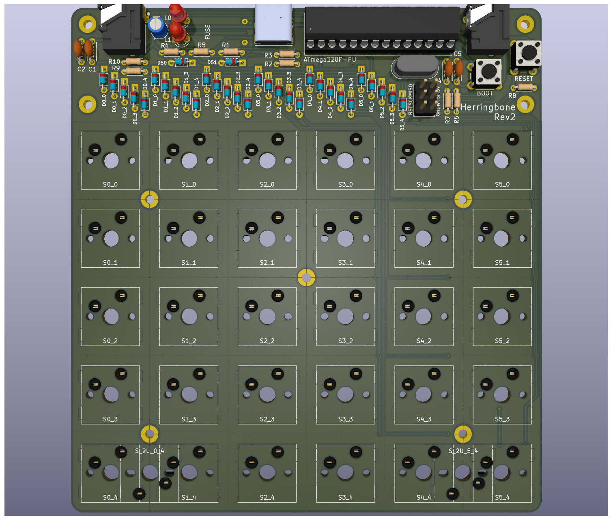

Herringbone
===============

A split ortholinear grid keyboard made with through hole components.

## Inspired by
 - [Plaid](https://github.com/hsgw/plaid)
 - [Torn](https://github.com/rtitmuss/torn)
 - [Discipline](https://github.com/coseyfannitutti/discipline)

## License

The Herringbone Keyboard is licensed under [Creative Commons Attribution-NonCommercial 4.0 International License](https://creativecommons.org/licenses/by-nc/4.0).

This PCB design may be freely reproduced, modified, and manufactured for personal use only.

